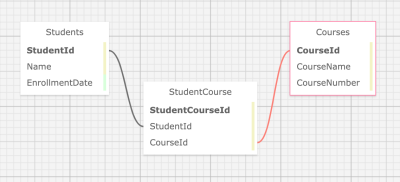

# University Registrar with Many-to-Many Relationships, Entity & MVC Web Interface

#### Two-day Homework Practice Assignment during Epicodus Coding School, ASP.NET Core MVC Many-to-Many Relationships, 1.4.2021

#### By Kaila Sprague McRae, Eric Endsley, & Danielle Thompson

---

## Description

This web application is for a university registrar to keep track of students & courses with the following functions:

- Keeps track of all students enrolled at the university with name & date of enrollment.
- Keeps track of all the courses the university offers with course name & course number(ex. HIST100).
- Assigns students to a course(s).



## Stretch Goals

- Have a feature to not allow database to take in duplicate entries for either courses or students. For example, the same student cannot enroll twice in a specific course, and a specific course cannot add a student to its roster twice.
- Add edit and delete functionality for Courses.
- Add course descriptions.
- Make course adding into a checkbox format to add multiple courses per student at one time.

- Create departments where a major can be declared by students & a course can be assigned to a department upon creation.
- Lists all the courses and all the students in a particular department.
- Edit a student's file to show course completion status.
- Lists all the courses a student has taken to compare to degree requirements.
- View how many students have not completed courses in any particular department, to see which departments need help.

---

## Technologies used

- C# v 7.3
- .NET Core v 2.2
- MySQL, MySQL Workbench
- Entity Framework Core, CRUD, RESTful routing
- dotnet script, REPL
- ASP.NET MVC Core
- Razor
- [SQL Design Planner](https://ondras.zarovi.cz/sql/demo/)
- [Visual Code Studio](https://code.visualstudio.com/)

---

## Installation Requirements

#### Installing Git

###### For Mac Users

- Access Terminal in your Finder, and open a new window. Install the package manager, (Homebrew) [https://brew.sh/], on your device by entering this line of code in Terminal: `$ /usr/bin/ruby -e "$(curl -fsSL https://raw.githubusercontent.com/Homebrew/install/master/install)"`.
- Ensure Homebrew packages are run with this line of code: `echo 'export PATH=/usr/local/bin:$PATH' >> ~/.bash_profile`.
- Once homebrew is installed, install Git, a version control system for code writers, with this line of code `brew install git`.

###### For Windows Users

- Open a new Command Prompt window by typing "Cmd" in your computer's search bar.
- Determine whether you have 32-bit or 64-bit Windows by following these (instructions)[https://support.microsoft.com/en-us/help/13443/windows-which-version-am-i-running].
- Go to (Git Bash)[https://gitforwindows.org/], click on the "Download" button, and download the corresponding exe file from the Git for Windows site.\_
- Follow the instructions in the set up menu.

#### For Both Mac & Windows systems

- Once you have Git installed on your computer, go to this (GitHub repository)[https://github.com/eric-endsley/registrar], click the "Fork" button in the upper right hand corner of the page, and clone this application with the following command:`git clone https://github.com/eric-endsley/registrar.git`.

#### Installing C#, .NET, dotnet script, & MySQL

- Install C# and .Net according to your operating system below.

###### For Mac

- Download this .NET Core SDK (Software Development Kit)[https://dotnet.microsoft.com/download/thank-you/dotnet-sdk-2.2.106-macos-x64-installer]. Clicking this link will prompt a .pkg file download from Microsoft.
- Open the .pkg file. This will launch an installer which will walk you through installation steps. Use the default settings the installer suggests.
- Confirm the installation is successful by opening your terminal and running the command $ dotnet --version, which should return something like: `2.2.105`.

###### For Windows (10+)

- Download either the the 64-bit .NET Core SDK (Software Development Kit)[https://dotnet.microsoft.com/download/thank-you/dotnet-sdk-2.2.203-windows-x64-installer]. Clicking these links will prompt a .exe file download from Microsoft.
- Open the file and follow the steps provided by the installer for your OS.
- Confirm the installation is successful by opening a new Windows PowerShell window and running the command dotnet --version. You should see something a response like this: `2.2.105`.

#### For Mac & Windows Operating Systems

- Install dotnet script with the following terminal command `dotnet tool install -g dotnet-script`.

#### Setting up a Local Database

- Download [MySQL Server](https://dev.mysql.com/downloads/file/?id=484914).
- Download [MySQL Workbench](https://dev.mysql.com/downloads/file/?id=484391).
- (For more detailed instructions if either of the above technologies are unfamiliar to you, visit [this site](https://www.learnhowtoprogram.com/c-and-net/getting-started-with-c/installing-and-configuring-mysql)).
- Run `dotnet build` when the project is on your local machine.
- Run `dotnet ef migrations add Initial`
  --> If there is an error stating "Unable to resolve project", this means the command wasn't run in the correct directory.
- Entity creates three files in the Migrations directory.
- Run the following command: `dotnet ef database update`.

#### MySQL Password Protection & .gitignore

Once the project has been cloned to your computer and you have all the necessary items on your local computer, open the project in the application of your choice.

Create a file in the root directory of the project called "appsettings.json". Add the following snippet of code to the appsettings.json file:

```
{
  "ConnectionStrings": {
    "DefaultConnection": "Server=localhost;Port=3306;database=registrar;uid=root;pwd=YOUR-PASSWORD-HERE;"
    }
}
```

Where you see "YOUR-PASSWORD-HERE" is where you put the password you created for your MySQL server. Your server name and port might vary depending on your local system. Check MySQL Workbench Connections to determine if the local host and port number match and adjust as needed.

Create a .gitignore file and add the following files & folders to it:

- obj/
- bin/
- .vscode/
- .DS_Store
- appsettings.json

#### Opening the Project on your Local System

- Navigate to the project folder on your Terminal or CMD.

- `dotnet build` will get bin/ and obj/ folders downloaded.
- `dotnet restore` to install packages listed in project's boilerplate.
- `dotnet run` will run the application.

---

## Known bugs

No known bugs as of now.

### Legal, or License

_MIT_ Copyright (c) 2021 _*Kaila Sprague McRae, Eric Endsley, & Danielle Thompson*_
